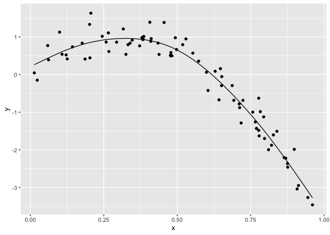

cross\_validation.Rmd
================
Ragyie Rawal

``` r
library(tidyverse)
```

    ## ── Attaching packages ─────────────────────────────────────── tidyverse 1.3.1 ──

    ## ✓ ggplot2 3.3.5     ✓ purrr   0.3.4
    ## ✓ tibble  3.1.4     ✓ dplyr   1.0.7
    ## ✓ tidyr   1.1.3     ✓ stringr 1.4.0
    ## ✓ readr   2.0.1     ✓ forcats 0.5.1

    ## ── Conflicts ────────────────────────────────────────── tidyverse_conflicts() ──
    ## x dplyr::filter() masks stats::filter()
    ## x dplyr::lag()    masks stats::lag()

``` r
library(modelr)
library(mgcv)
```

    ## Loading required package: nlme

    ## 
    ## Attaching package: 'nlme'

    ## The following object is masked from 'package:dplyr':
    ## 
    ##     collapse

    ## This is mgcv 1.8-38. For overview type 'help("mgcv-package")'.

``` r
set.seed(1)

nonlin_df = 
  tibble(
    id = 1:100, 
    x = runif(100, 0, 1),
    y = 1 - 10 * (x - 0.3) ^ 2 + rnorm(100, 0, 0.3)
  )

nonlin_df %>% 
  ggplot(aes(x = x, y = y)) + 
  geom_point()
```

<!-- -->

Create splits by hand; plot; fit some models

``` r
train_df = sample_n(nonlin_df, 80)
test_df = anti_join(nonlin_df, train_df, by = "id")

ggplot(train_df, aes(x = x, y = y)) + 
  geom_point() + 
  geom_point(data = test_df, color = "red")
```

<!-- -->

Fit my models:

``` r
linear_mod = lm(y ~ x, data = train_df)
smooth_mod = mgcv::gam(y ~ s(x), data = train_df)
wiggly_mod = mgcv::gam(y ~ s(x, k = 30), sp = 10e-6, data = train_df)
```

plot the results

``` r
train_df %>% 
  add_predictions(smooth_mod) %>% 
  ggplot(aes(x = x, y = y)) + 
  geom_point() +
  geom_line(aes(y = pred))
```

<!-- -->

Quantify the results

``` r
rmse(linear_mod, test_df)
```

    ## [1] 0.7052956

``` r
rmse(smooth_mod, test_df)
```

    ## [1] 0.2221774

``` r
rmse(wiggly_mod, test_df)
```

    ## [1] 0.289051

### CV linearity

Use ’modelr::crossv\_mc".

``` r
cv_df =
  crossv_mc(nonlin_df, 100) %>% 
  mutate(
    train = map(train, as_tibble),
    test = map(test, as_tibble)
  )
```

Let’s fit some models

``` r
cv_df %>% 
  mutate(
    linear_mod = map(.x = train, ~lm(y ~ x, data = .x)),
    smooth_mod = map(.x = train, ~gam(y ~ s(x), data = .x)),
    wiggly_mod = map(.x = train, ~gam(y ~ s(x, k = 30), sp = 10e-6, data = .x))
  ) %>% 
  mutate(
    rmse_linear = map2_dbl(.x = linear_mod, .y = test, ~rmse(model = .x, data = .y)),
    rmse_smooth = map2_dbl(.x = smooth_mod, .y = test, ~rmse(model = .x, data = .y)),
    rmse_wiggly = map2_dbl(.x = wiggly_mod, .y = test, ~rmse(model = .x, data = .y))
  )
```

    ## # A tibble: 100 × 9
    ##    train   test   .id   linear_mod smooth_mod wiggly_mod rmse_linear rmse_smooth
    ##    <list>  <list> <chr> <list>     <list>     <list>           <dbl>       <dbl>
    ##  1 <tibbl… <tibb… 001   <lm>       <gam>      <gam>            0.675       0.298
    ##  2 <tibbl… <tibb… 002   <lm>       <gam>      <gam>            0.655       0.336
    ##  3 <tibbl… <tibb… 003   <lm>       <gam>      <gam>            0.785       0.295
    ##  4 <tibbl… <tibb… 004   <lm>       <gam>      <gam>            0.874       0.263
    ##  5 <tibbl… <tibb… 005   <lm>       <gam>      <gam>            0.784       0.250
    ##  6 <tibbl… <tibb… 006   <lm>       <gam>      <gam>            0.844       0.324
    ##  7 <tibbl… <tibb… 007   <lm>       <gam>      <gam>            0.791       0.274
    ##  8 <tibbl… <tibb… 008   <lm>       <gam>      <gam>            0.758       0.310
    ##  9 <tibbl… <tibb… 009   <lm>       <gam>      <gam>            0.621       0.287
    ## 10 <tibbl… <tibb… 010   <lm>       <gam>      <gam>            0.839       0.338
    ## # … with 90 more rows, and 1 more variable: rmse_wiggly <dbl>

Look at output
